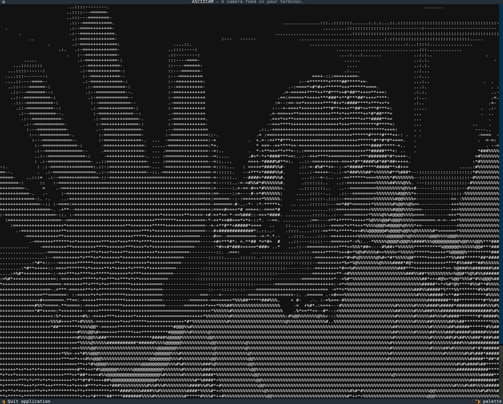

# asciicam

A live camera feed for your terminal.



**asciicam** is a small application, trying to bring the camera into the terminal.

## Features
- **Live camera Feed**: Stream video from your webcam in real-time
- **ASCII Conversion**: Converts frames to graysale ASCII art.
- **Terminal UI**: Built with [textual](https://textual.textualize.io/) for smooth display in the terminal.
- **Copy to Clipboard**: Easily copy ASCII frames using [pyperclip](https://pypi.org/project/pyperclip/)

## Development
### Set up development environment

**Install [uv](https://docs.astral.sh/uv/guides/install-python/)**
```bash
curl -LsSf https://astral.sh/uv/install.sh | sh
```

**Clone repository**
```bash
git clone https://github.com/arcathrax/asciicam.git ~/Downloads/asciicam
```

**Run application**
```bash
cd ~/Downloads/asciicam
uv run main.py
```

### Generating a binary

**Go to repo**
```bash
cd ~/Downloads/asciicam
```

**Create and enter venv**
```bash
python -m venv venv
source venv/bin/activate
```

**Install dependencies**
```bash
pip install opencv-python textual pyperclip pyinstaller 
```

**Generate binaries**
Note that here the `asciicamera.tcss` also gets added to the binary.
```bash
pyinstaller --onefile --hidden-import=pyperclip --add-data "asciicamera.tcss:." main.py
```

The binary is now under in the `dist` folder and called `main`.
